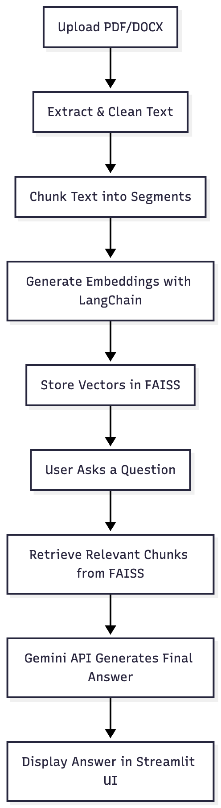

# Information Retrieval System

## Overview

The **Information Retrieval System** is a **Streamlit-based AI app** built with **Python** that enables users to upload documents (`PDF` or `DOCX`) and ask natural language questions about their content.  
It uses **LangChain**, **FAISS**, and **Google Gemini API** to process, embed, and retrieve the most relevant answers based on semantic similarity.

---

## Key Features

- Upload and process **PDF** or **DOCX** files
- Ask **natural language questions** related to the uploaded document
- Intelligent **chunking and embedding** for better context retrieval
- **Gemini API** integration for accurate and human-like responses
- **LangChain + FAISS** pipeline for efficient semantic search
- Simple, interactive **Streamlit UI**

---

## Tech Stack

| Category                 | Technologies                                  |
| ------------------------ | --------------------------------------------- |
| Language                 | Python                                        |
| Framework                | Streamlit                                     |
| AI / NLP                 | Google Gemini API (via `google-generativeai`) |
| Embedding / Vector Store | LangChain + FAISS                             |
| Parsing                  | PyMuPDF (`fitz`), `python-docx`               |
| Environment              | `.env` (dotenv)                               |

---

## Requirements

```bash
pip install streamlit
pip install faiss-cpu
pip install google-generativeai
pip install PyMuPDF
pip install python-docx
pip install langchain
pip install python-dotenv
```

---

## Installation & Setup

### 1. Clone the Repository

```bash
git clone https://github.com/priyanshutariyal02/information-retrieval-system.git
cd information-retrieval-system
```

### 2. Create a Virtual Environment

```bash
python -m venv venv
# Activate
source venv/bin/activate     # For Mac/Linux
venv\Scripts\activate        # For Windows

```

### 3. Install Dependencies

```bash
pip install -r requirements.txt
```

### 4. Add Google API Key

Create a .env file in the project root and add your key:

```bash
GOOGLE_API_KEY=your_google_api_key_here
```

You can get your API key from [Google AI Studio](https://aistudio.google.com/)

## How It Works

<details>
<summary>Siquence diagram</summary>

</details>

## Usage

```bash
streamlit run app.py
```

### Interaction Steps

1. **Upload File** → Choose a .pdf or .docx document

2. **Processing** → The system cleans, chunks, and embeds the document

3. **Ask Question** → Type a question related to the document

4. **Retrieve Answer**→ The app fetches the most contextually relevant response

## Example

### Uploaded Document: AI Research Report.pdf

#### User Query:

What is the main objective of this research?

#### System Response:

The paper aims to enhance document-level understanding by integrating transformer-based models with retrieval-augmented learning for improved contextual accuracy.
